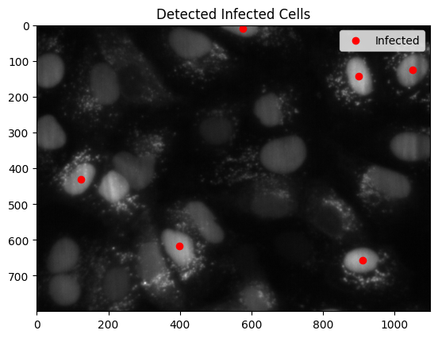
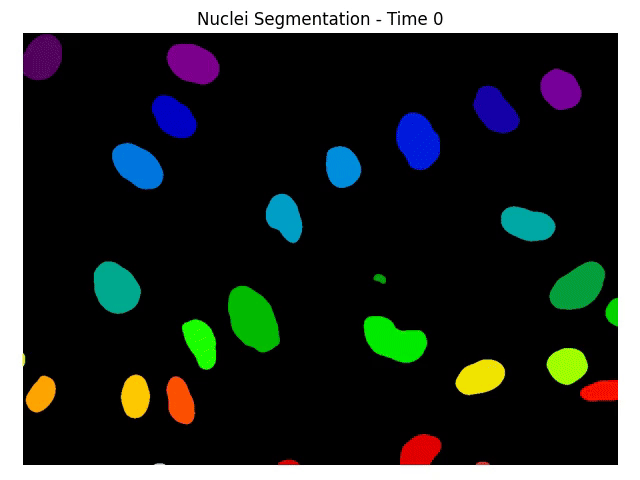

# 📄 **README.md**

## Explore play.ipynb to explore more

# Infection Pipeline CLI (OME-Zarr Analysis)

This project provides a Command-Line Interface (CLI) for:
- **Nuclei Segmentation** from OME-Zarr microscopy data
- **Infection Detection** based on viral intensity
- Saving results as **frames**, **videos**, **segmentation Zarrs**, **CSV metrics**, and **infection visualizations**.


## 🛠 CLI Usage

You can segment images, create videos, detect infections, save outputs as images or CSV files.

> **Tip:** These are examples you can paste in your terminal to test the full pipeline:

---

### 🔹 1. Segment All Time Points, Save as Frames
```bash
iohub-cli segment \
  --zarr_path dataset2/20241107_infection.zarr \
  --zarr_name C/2/001000/0 \
  --channel_idx 1 \
  --output_dir results/frames \
  --save_mode frames
```

---

### 🔹 2. Segment All Time Points, Save as Video
```bash
iohub-cli segment \
  --zarr_path dataset2/20241107_infection.zarr \
  --zarr_name C/2/001000/0 \
  --channel_idx 1 \
  --save_mode video \
  --video_path results/segmentation_video.mp4
```

---

### 🔹 3. Segment Only Time Points 0, 1, 2
```bash
iohub-cli segment \
  --zarr_path dataset2/20241107_infection.zarr \
  --zarr_name C/2/001000/0 \
  --time_indices 0 1 2 \
  --output_dir results/subset_frames \
  --save_mode frames
```

---

### 🔹 4. Save Segmentation Masks as Zarr
```bash
iohub-cli segment \
  --zarr_path dataset2/20241107_infection.zarr \
  --zarr_name C/2/001000/0 \
  --save_zarr \
  --output_zarr_path results/segmentations.zarr
```

---

### 🔹 5. Run Infection Metric Analysis (no plot display)
```bash
iohub-cli infection \
  --zarr_path dataset2/20241107_infection.zarr \
  --zarr_name C/2/001000/0 \
  --time_index 0 \
  --no_display
```

---

### 🔹 6. Save Infection Visualization
```bash
iohub-cli infection \
  --zarr_path dataset2/20241107_infection.zarr \
  --zarr_name C/2/001000/0 \
  --save_infection_projections \
  --infected_projection_filepath results/infected_cells.png \
  --no_display
```

---

### 🔹 7. Save Infection Metrics to CSV
```bash
iohub-cli infection \
  --zarr_path dataset2/20241107_infection.zarr \
  --zarr_name C/2/001000/0 \
  --save_infection_metrics \
  --infection_metrics_filepath results/infection_metrics.csv \
  --no_display
```

---

### 🔹 8. Save Both Visualization and CSV Metrics
```bash
iohub-cli infection \
  --zarr_path dataset2/20241107_infection.zarr \
  --zarr_name C/2/001000/0 \
  --save_infection_projections \
  --infected_projection_filepath results/infected_cells.png \
  --save_infection_metrics \
  --infection_metrics_filepath results/infection_metrics.csv \
  --no_display
```

---

## 📊 Example Outputs

### Infection Metrics (CSV table example)

```python
infection_metrics = infection_metrics_from_zarr(
    DATASET2_PATH,
    zarr_name=nuclie_zarr_name,
    time_index=10,
    display_projections=True,
)
infection_metrics.head()
```

| label | area  | mean_intensity | max_intensity | centroid-0 | centroid-1 | infected |
|:-----:|:-----:|:--------------:|:-------------:|:----------:|:----------:|:--------:|
|   1   | 1433  |    127.098244   |   133.089203  |   9.541521 |  576.383810|   True   |
|   2   | 6069  |    116.234879   |   122.593857  |  50.928159 |  423.708683|   False  |
|   3   | 5585  |    118.213226   |   125.937561  | 126.039749 |  33.599821 |   False  |
|   4   | 4882  |    129.159470   |   140.766922  | 125.468865 | 1049.851290|   True   |
|   5   | 4660  |    140.241196   |   154.744888  | 142.434549 |  900.399571|   True   |





